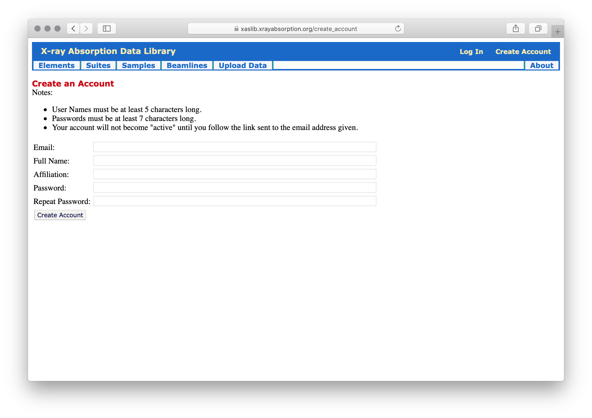

Accounts
==================

Logging in to the XAS Data Library (**xaslib**) permits users to add content to
the library.

Why Log in to the XAS Data Library?
----------------------------------------------

While the data on the XAS Data Library (xaslib) are free to use without
restrictions, anonymous users are not permitted to add any content or
comments on the data in the library.  Logging in to xaslib allows you to do
the following:

   1. add a rating and review for any existing spectrum or suite of spectra.
   2. create a suite from any existing spectra.
   3. upload spectra.  This includes being able to edit the data and
      associated sample, and literature citations.
   4. add beamlines and facilities.

Creating an Account and Logging in
----------------------------------------------

Creating an account on xaslib is easy.  Follow the *Create Account* link at
the upper right of the page, and enter your email address, name,
affiliation, and password.

.. _web_login1:

    The Create Account Page

On hitting the *Create Account* button, a confirmation email will be sent,
and you will not be able to log in to your account until the link in that
email is followed.  This helps ensure that the person creating the account
is really at that email address.

The intention is for people in the XAFS community to log in and add
content.  Spectra, suites, and ratings will all have an account name
associated with them that will be shown to all users.  We ask and expect
that people logging in will use real names and affiliations.

While we do not track usage, we do expect people to follow normal rules of
polite academic discourse and avoid personal attacks, spamming, or other
forms of unethical behavior.  We reserve the right to disable accounts and
ban users that violate these norms.

A note on passwords
----------------------------------------------

The password used for accounts on xaslib should follow the normal rules for
good passwords.  We require only that they are at least 7 characters long,
but you should not use common words or passwords used for other accounts.

The passwords for these accounts are stored on the
https://xrayabsorption.org server following typical "best practices" for
securely storing passwords.  The passwords are not stored in plain text, we
cannot recover them directly. A clever person with access to the server who wanted
to find your password might see a string like this::

    sha512$00200000$BgIRqxE9Y8ARsDWYDuquwmWKPe+j1GlQ$
    ksCKf76FZ1QTMxMZRFNLYSFxh4zfKcxgAbinKXS9g3xOyw8uQ0La1J+AM0PdH7aOVND8r2OrUBcHVhteDQwLMw

to represent your password. There is no deterministic way to convert this
string back to your password.  Even with knowledge of how the algorithms
and hashing work, it would require an inordinate amount of time to guess
the password that generates this string.  Well, unless someone can guess
your password.

If you forget your password, you can use the *Reset Password* button at
https://xaslib.xrayabsorption.org/login.  This will be similar to creating
an account in that a confirmation email will be sent to you to follow a
link for resetting your password.
