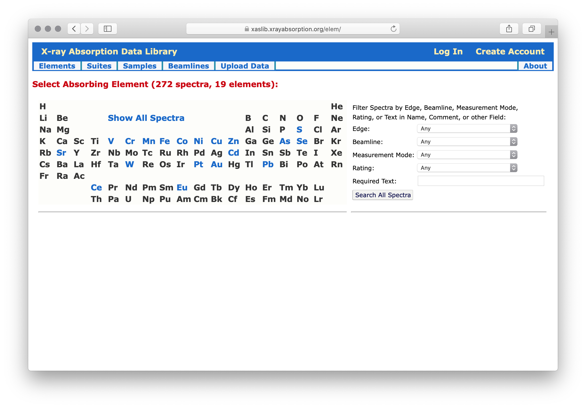
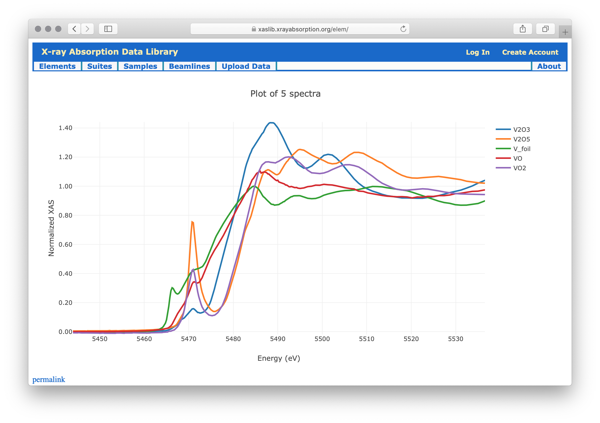

Using the X-ray Absorption Data Library
=========================================================

The X-ray Absorption Data Library (**xaslib**) website
`<https://xaslib.xrayabsorption.org>`_ presensts tools to browse and view a
collection of X-ray Absorption Spectroscopy (XAS) data held by `The
International X-ray Absorption Society <https://xrayabsorption.org>`_.  The
main web page will show a periodic table for browsing spectra by absorbing
element:

.. _web_fig1:

    The X-ray Absorption Data Library website

Clicking on any of the element symbols will show a list of spectra for that
element.  The form on the right hand side allows further refinement of the
displayed spectra, based on which *Edge*, *Beamline*, *Measurement Mode*,
*Rating*, or *Text* found in the information for the spectra.

As an example element with a relatively small number of spectra, clicking
on **V** will show a table with 5 spectra for vanadium:

.. _web_fig2:

    Spectra selections for vanadium

Here, the table shows spectrum Name, Edge measured, the Beamline used, and
an optional Rating for each spectrum.

Clicking on the name of any of the spectra will take you to a page
dedicated for that spectrum, as discussed below.  There are also buttons to
the right of the spectra table to "Plot Spectra" and "Save Zip File" for
spectra selected with the check-boxes.  You can use the "Select All" and
"Select None" links to fill in all or none of the checkboxes.  Clicking on
"Select All" and then "Plot Spectra" will bring up a page with an
interactive plot of the 5 selected spectra.  This will look like this:

.. _web_fig3:

.. figure::  _images/plot_vanadium.png
    :target: _images/plot_vanadium.png
    :width: 85%
    :align: center

    Example plot for selected vanadium spectra.

This plot is interactive in a few ways:

    1. hovering your mouse over the plot will bring up a small toolbar
    allowing you zoom in, zoom out, pan, reset the scale, and save an image
    of the plot.

    2. clicking and dragging will zoom in on a portion of the plot.  You
    can double-click to zoom out, or use the toolbar.

    3. clicking on the entries in the legend (for example the label with
    the blue line and **V2O3**) will toggle whether that spectra is shown
    or hidden in the plot.

This allows you to interactively zoom in to better see the differences in
the V XANES:

.. _web_fig4:

    Zoom in of vandium XANES.

Returning to the main page (using the browser's "back" button will return
to the earlier page of selected spectra), where you can also use the "Save
Zip File" to download a zip file with the data files for the selected
spectra.

.. _WebSpectra:

The XAS Spectrum
-----------------------------------------

The data in xaslib contains several kinds of information, but the most
important of these is the *XAS Spectrum*.  This contains an XAS spectrum
:math:`\mu(E)`, which is to say arrays of numbers for *Energy* and
*Absorbance*, and a set of *meta-data* that goes along with each spectrum
to help describe it the important details needed to use these data.  The
full details of what metadata is stored and how will be given in
:ref:`database`, and the emphasis here will be on using the web library.

Clicking on any of the spectra listed in the Spectrum Table, such as shown
in the Figure for :ref:`web_fig2`, will bring up a page with information
for that spectrum that looks like this:

.. _web_fig5:

.. figure::  _images/web_spectrum.png
    :target: _images/web_spectrum.png
    :width: 85%
    :align: center

    Example page for a single spectrum.

On the left side is a list of fields describing the data, including
element, edge, sample name, beamline, monochromator used, person owning the
spectrum, and so on.  Many of these fields will be links that lead to, for
example, the raw data file, the beamline, and more details on the sample.
On the right side is a plot of the spectrum.  This will be interactive as
described for the plots.  You can switch between plotting the full range of
the raw XAS spectrum or a simple attempt at producing normalized XANES.
If a reference sample has been used in the measurement, its spectrum will
also be displayed.

.. _WebSuites:

Suites of Spectra
----------------------------------

As described breifly in :ref:`Suites`, a **suite** is simple a collection
of spectra.  Like spectrum, suites of spectra can be rated or reviewed (see
:ref:`Ratings`).  Anyone can view the defined suites of spectra, including
plotting all the spectra in the suite, or downloading all spectra to a zip
file.  A list of suites will look like this:

.. _web_fig6:

    Example page for list of suites
    

People who are logged in will be able to create new suites, edit suites
(alter the description, add and remove spectra) that they have created, and
rate existing suites.

     
.. _WebSamples:

Information about Samples
-----------------------------------------

Each spectrum will have a Sample associated with it.  It is OK to use a
sample for 2 or more spectra.  The full list of samples can be accessed
from the Samples link at the top menubar on the web page, which will show
something like

.. _web_fig7:

    List of samples

Clicking on the name of each sample will give more information, such as

.. _web_fig8:

    Sample description.

People who have logged in will be able to edit samples.

.. _WebBeamlines:

Beamlines and Facilities
-----------------------------------------

Each spectrum will have a Beamline associated with it, indicating where the spectrum
was collected.  There is a comprehensive - but no doubt incomplete - list
of beamlines around the world, and the facilities they belong too. 

.. _web_fig9:

    List of known XAS beamlines

People who have logged in will be able to add new or edit existing beamlines.

.. _WebCitations:

Literature Citations
-----------------------------------------

Each spectrum can have a literature citation associated with it.   For
people logged in and editing a spectrum, a citation can be added or
edited. 
